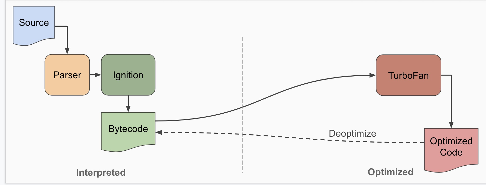
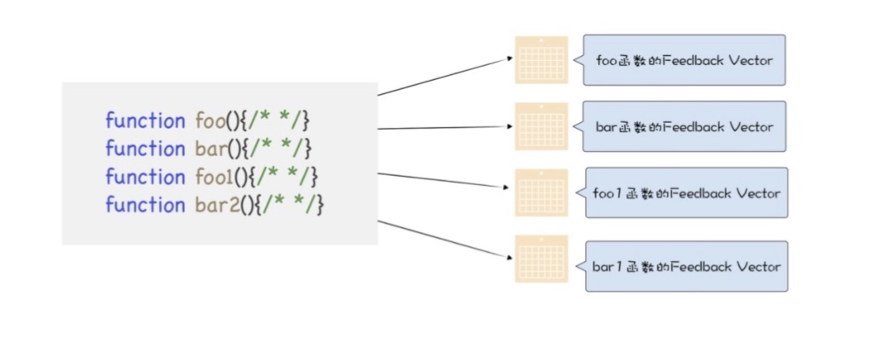
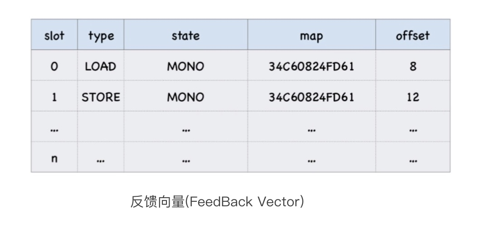
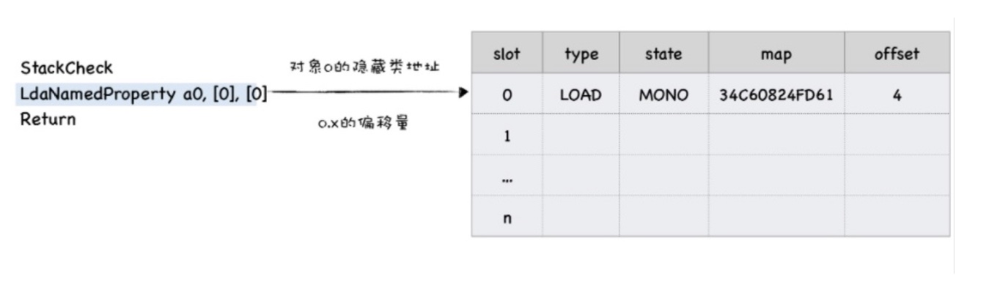
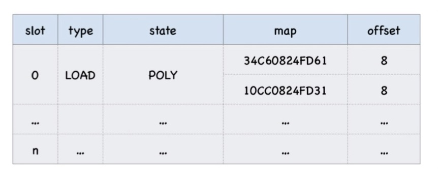
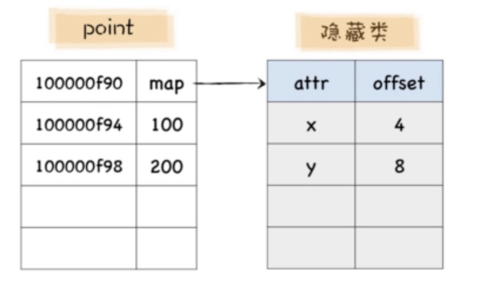
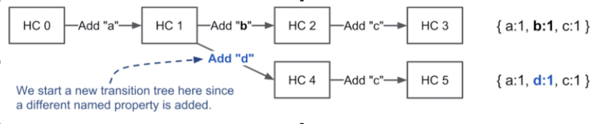
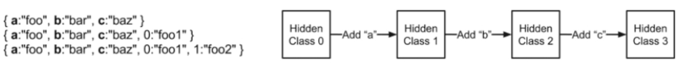
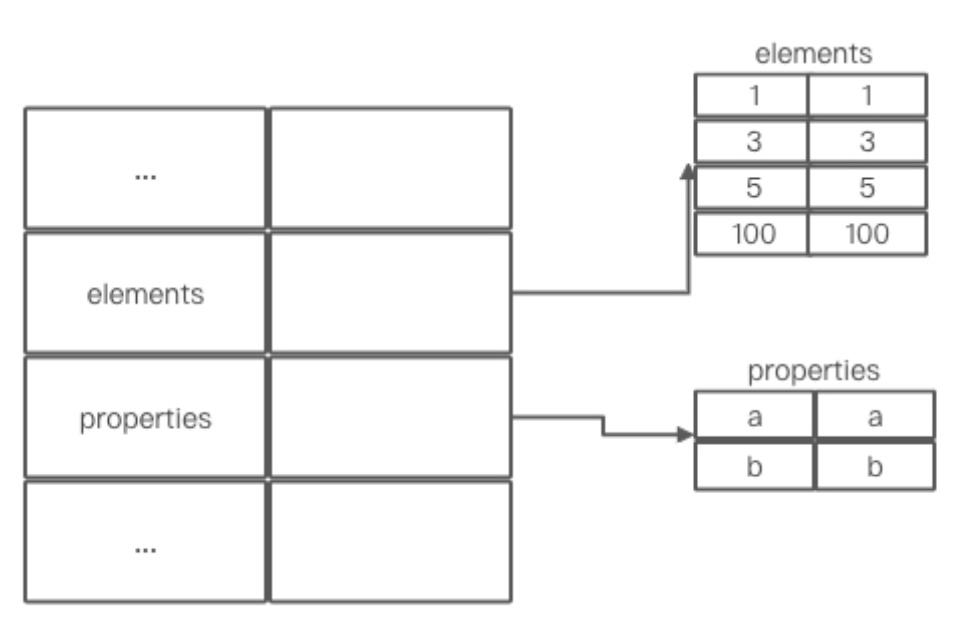
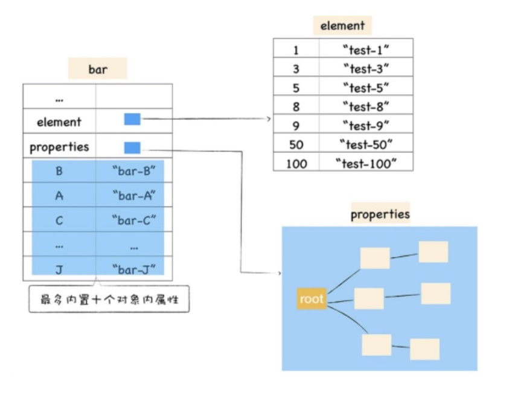

V8 是 Google 团队开发的一个 JavaScript 开源引擎，Chrome 浏览器在2008年发布，经过起起伏伏，最终在2012年超越IE，在全球的浏览器市场占有率第一。在本文我们一起来探索 V8 是如何提升性能的。我们将从围绕 V8 执行 JavaScript 代码的过程，选取几个优化策略进行学习了解。
<!-- more -->
<br><br>

首先我们先来了解一下 V8 是如何执行 JavaScript 代码的？V8 采用的是JIT (Just In Time)的执行方式，这是一种结合了解析执行和编译执行的混合执行方式。结合了解析执行的快速执行、内存优化和编译执行的高性能执行的特点。下面简单介绍一下 V8 执行一段代码所经历的主要流程。

1. 初始化基础环境
在 V8 启动执行 JS 之前，它还需要准备执行 JS 时所需要的一些基础环境：
    * 全局执行上下文
    * 全局作用域
    * 堆、栈
    * 消息循环系统：消息驱动器，消息队列

2. Parser 解析 JS 代码，生成 AST 和作用域，Ignition 根据AST和作用域生成字节码。<br>
JS 代码对 V8 来说只是一堆字符串，并不能理解它的含义，需要将其结构化——生成抽象的语法树AST，AST 是便于 V8 理解的结构。
在生成AST的同时V8还会生成相关的作用域，作用域中存放相关变量信息（这个时候变量都还是undefined，没有被赋值）。
根据AST和作用域生成字节码，字节码是介于AST和机器代码（针对不同的CPU架构编写特定的代码）的中间代码，但是它与特定类型的机器代码无关。浏览器解释器可以直接解释执行字节码，

3. 执行字节码<br>
按照顺序执行字节码，并输出执行结果。

4. 监听热点代码<br>
将重复执行的字节码标记为热点代码

5. TurboFan: 优化热点代码为二进制的机器代码<br>
TurboFan 在后台将热点代码编译为优化代码，下次再执行这段代码，V8会优先选择优化代码，这样代码的执行速度会大幅提升。

6. 反优化机器代码<br>
优化的代码被修改了，就需要执行反优化操作。经过反优化的代码下次执行就会回退到 Ignition 解释执行


### 代码执行后的代码缓存

V8 使用两种代码缓存策略来缓存生成的代码，以便以后重用。首先是存在于每个 V8 实例中的内存缓存（in-memory cache）。初始编译后生成的代码存储在此缓存中，以源字符串作为 key。这可以在 V8 的相同实例中重复使用。另一种代码缓存序列化生成的代码并将其存储在磁盘上供将来使用。该缓存并不只属于 V8 的特定实例，可以在 V8 的不同实例中使用。

从 V8 v6.6 (Chrome 66) 开始，当引擎在顶层执行后，我们会把生成的更多代码缓存起来。这会导致初始加载时分析和编译时间缩短 20-40%。

1. 首次请求 JS 文件 (cold run) 时， Chrome第一次看到访问过的网页，并且根本不缓存任何数据。

2. 当第二次请求 JS 文件 (即 warm run) 时，Chrome记住该网页已经被访问过，可以从缓存中检索某些资产（例如图像和脚本源文件）。V8识别出该页面已经附带了相同的脚本文件，将序列化的生成代码（generated code）与脚本文件一起缓存在磁盘中，并使用脚本资源的 URL 作为 key。

3. 第三次 (hot run)，Chrome第三次访问网页时， Chrome 会将序列化的数据作为编译请求的一部分传递给 V8。然后 V8 反序列化这些数据，而不是解析和编译脚本。


### 延迟解析

V8执行JS代码需要经过编译和执行两个阶段，在编辑阶段，JS代码转换为字节码或者二进制代码，执行阶段解释器解释执行字节码，或者CPU直接执行二进制代码。

在编译过程中，V8并不会将所有的代码解析为中间代码（字节码或二进制代码），所有主流的JS虚拟机都实现了惰性解析 —— 解析器在解析的过程中，如果遇到函数声明，会跳过函数内部的代码，并不会为其生成AST 和字节码，只生成这一层的AST和字节码。

这样做的原因是解析和编译所有的代码会增加编译时间，会影响首次执行代码的时间；中间代码会存放在内存中，一次性解析和编译所有的代码，一些中间代码会一直占用内存。

```
// 1. 遇到 foo 函数, 将函数转换为函数对象。（没有解析和编译函数内部的代码）
function foo (a, b) {
  var d = 1;
  var f = 1;
	return d + f +  a + b;
}

// 2. 生成AST 和 中间代码。
var global_a = 1;
var global_b = 1;

// 从 foo 函数对象中取出函数代码，编译，执行
foo(global_a, global_b);
```


### 内联缓存

先看一段代码：
```
function loadX () {
    return o.x;
}
var o = { x: 1, y: 3 };
var o1 = { x: 3, y: 6 };
for (var i = 0; i < 10000; i++) {
    loadX(o);
  loadX(o1);
}
```

获取o.x的流程为：查找对象 o 的隐藏类，通过隐藏类查找属性x的偏移量，然后通过偏移量（相对对象o的）获取属性值。这里经过三个步骤，在for循环中反复执行了loadX函数去获取 o.x，是否有办法去简化获取过程？这个时候就该内联缓存（Inline Cache）登场了。

V8 在执行函数的过程会观察一些调用点上的关键“中间数据”，然后将这些数据缓存起来，下次再执行该函数的时候，V8就可以直接利用这些“中间数据”，以此节约再次获取这些数据的过程。IC 会为每个函数维护一个反馈向量(FeedBack Vector)，它记录了函数在执行过程中的一些关键数据。



反馈向量是一个表结构，表结构的每一个行称为一个插槽(Slot)，每个插槽包括插槽的索引、插槽的类型(type)、插槽的状态(state)、隐藏类(map)的地址和属性偏移量(offset)。插槽的类型有访问类型(LOAD)，存储类型(STORE)，函数调用类型(CALL)。


在执行函数过程中，会不断读取插槽中的数据，或者写入“中间数据”到反馈向量，形成一个新的插槽。
以loadX 函数为例，演示 LOAD 类型。将loadX转换为字节码：

```
StackCheck
LdaNamedProperty a0, [0], [0]
return
```

这三行字节码表示：
  1. 检查栈是否溢出
  2. 取出参数a0 的第一属性值，并将属性值当道累加器中。
  a0 表示loadX的第一个参数，
  第一个 [0] 表示取出对象a0的第一个属性值
  第二个[0] 将LdaNamedProperty操作的中间数据写入到反馈向量中，其中'0' 表示写入反馈向量的第一个插槽中。
  3. 返回累加器中的属性值

  现在loadX函数的反馈向量就是这个样子：


当再次调用loadX 函数时，执行laodX函数中的语句时，他就会在对应的插槽中查找对应的偏移量，然后就可以直接在内存中获取执行结果了。

*多态和超态*：在文章开始的那段代码中，有两个对象，意味着会创建两个隐藏类。在 for 循环中执行了两次loadX函数分别读取这两个对象的 x 属性， 第一次执行时，loadX函数的反馈向量会存储o.x 的偏移量。再执行loadX，读取o1.x时，会取出反馈向量中的记录的隐藏类和o1进行比较，发现不是同一个隐藏类，不能使用。于是新的隐藏类也被记录到同一个插槽中。

当在函数执行一个已经执行过的属性读取语句 (return o.x)，V8 会将这个要被访问的对象的隐藏类和插槽中的隐藏类对比，如果找到同样的隐藏类，就会使用这个隐藏类，如果没有找到，就在同一个插槽添加一个新的隐藏类。



单态：1个隐藏类，多态：包含了 2～4 个，超态：超过4个。单态和多态会使用的线性结构来存储，超态会使用 hash 表储存，单态，多态，超态，(隐藏类)访问复杂度依次增大，执行效率依次减弱。所以建议使用单独的函数读取不同对象的属性，这样就会为不同的函数创建不同的反馈向量。

### 隐藏类

在静态语言中的在执行过程是对象无法修改的，在编译的时候会将对象属性的地址写进汇编指令，在访问对象的属性时，就可以直接去内存中取出该内容即可。这种直接通过偏移量来查询对象属性的方式也是静态语言执行效率高的一个原因。
这个特性是否利用在JS中呢？答案是可以的。

对象创建好了之后就不会添加新的属性，且不会删除属性。V8 就可以对对象做深度优化，为每一个对象建立一个隐藏类，隐藏类记录对象中所有的属性及其相对于对象的偏移。

当访问某个对象的某个属性，就会先在隐藏类中查找该属性相对于与它所在变量的偏移量，有了偏移量和属性，就可以直接从内存中取出对应的属性值。这就是 V8 将动态语言静态化的一个操作，引入隐藏类，模拟C++这种静态语言的机制，从而达到静态语言的执行效率。

隐藏类描述了对象属性的布局，主要包含了属性名及其对应的偏移量。例如对象point
`let point = { x: 4; y: 8 };`
point 对象的隐藏类就包括了 `x` 和 `y` 属性，偏移量分别为 4 和 8.


*多个对象共用一个隐藏类*：在V8中每个对象都有一个map属性，该属性指向对象的隐藏类，如果两个对象属性名称和个数都相同，V8 将会复用同一个隐藏类。这样可以减少隐藏类的创建次数，间接加速了代码执行速度，减少了隐藏类的存储空间。

*重新构造隐藏类*：前面提到了实现隐藏类的假设条件：对象创建好了之后就不会添加新的属性，且不会删除属性。如果这两个条件任意一个被破坏（添加数组索引属性不会创建新的隐藏类），V8 就要为新的对象构建新的隐藏类，每添加新的命名属性都会导致一个新的隐藏类被创建。




### 对象内属性、快属性和慢属性

JavaScript 对象像一个字典，字符串作为键名，任意对象可以作为键值，通过键名读写键值，然而在V8实现对象存储时，并没有完全采用字典的存储方式。
因为字典是非线性的数据结构，查询效率会低于线性的数据结构，V8 为了提升存储和查找效率采用了一套复杂的存储策略。

看一段代码：
```
var obj = {
  b: 'b',
  100: 100,
  5: 5,
  3: 3,
  a: 'a',
  1: 1
};
for (let i in obj) {
  console.log(i, obj[i]);
}
// 顺序打印：
// 1 1
// 3 3
// 5 5
// 100 100
// a a
// b b
```

打印的顺序并不是属性在obj里的顺序，因为ECMAScript 规范中定义了数字（数字字符串会转换为数字）属性应该按照索引值大小升序，字符串属性根据创建的顺序排列。

对象中的数字属性被称为排序属性(elements)，字符串属性被称为常规属性(properties)。为了提升存储和访问这两种属性的性能，V8 使用了两个线性数据结构来分别保存这两种属性。



将不同的属性保存到 elements 和 properties 属性中，虽然简化了程序的复杂度，但是在查找元素时却多了一步操作，因此会影响到元素的查找效率。基于这个原因，V8采取了一个权衡的策略以加快查找属性的效率。将部分常规的属性直接存储到对象本身，我们把这称为对象内属性(in-object properties).

采用对象内属性之后，读取“a” 属性就可以直接从对象本身去获取该值，这种方式减少了查找步骤，提高了查找效率。不过对象内属性的数量是固定的，默认是10个，超出的就会被保存在常规属性。保存在线性数据结构中的属性称之为“快属性”，虽然访问快属性速度快，但是如果从线性结构中添加或者删除大量的快属性时会产生大量时间和内存的开销，导致执行效率会很低。

因此，如果一个对象的属性过多，V8就会采用另外一种存储策略——“慢属性”策略，慢属性的对象内部会有独立的非线性数据结构（词典）作为属性存储容器。所有的属性元信息不再是线性存储的而是直接保存在属性字典中。



### 总结
本文从“代码执行后的代码缓存”，“内联缓存”，“延迟解析”，“隐藏类”，“对象内属性、快属性和慢属性”等5个点来探究V8 是如何来做优化的。“代码执行后的代码缓存”优化执行多次加载的代码，
缓存其顶层作用域的字节码。“内联缓存”使用反馈向量保存函数里的每条语句的执行结果，当再次执行时会直接在反馈向量中取出缓存结果。“延迟解析”为了尽快执行代码，
最先只会解析“顶层”代码。“隐藏类”使JavaScript在读取对象中属性时拥有接近静态语言的性能。“对象内属性、快属性和慢属性” 提高了对象属性的查找效率。

感谢你的阅读，才疏学浅，若有错误，欢迎指出～

参考链接：

https://v8.js.cn/blog/blinkon-6/

https://v8.js.cn/blog/improved-code-caching/

https://v8.js.cn/blog/code-caching-for-devs/

https://v8.js.cn/blog/fast-properties/

《极客时间-图解V8》
