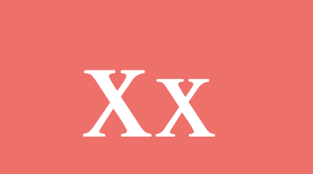
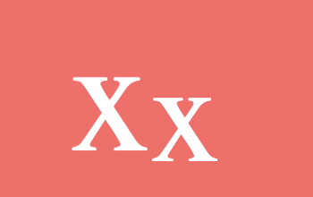
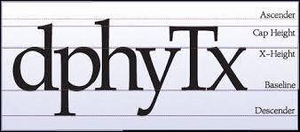
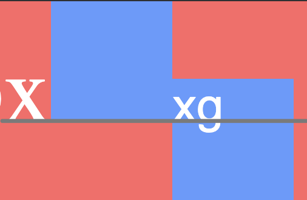
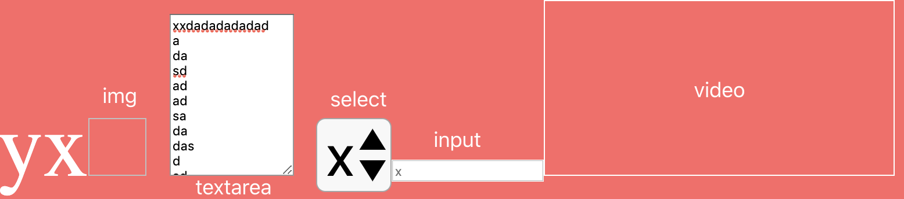
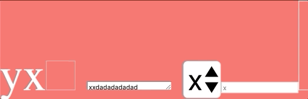
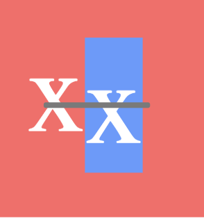
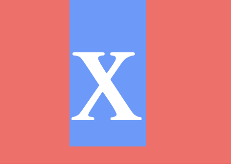
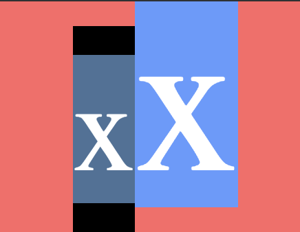

# 为什么写这篇文章
这一切都得从一个百思不得其解的问题说起。首先因为我一个错误的认知，以为只要在一行里设置了`line-height`，那么这一行的文字都会居中显示，这种效果如果在字号一样的情况下是正常的，但是在一行里面如果有字号不一样的文字，情况就不一样了。

第二个X并没有垂直居中，此时我想到了`vertical-align`这个偏方，试着对后面那个X设置了`vertical-align:middle`，于是神奇的事情发生了，后面那个字没有像预期那样上移动，反而向下移动少许。

what？？？这么神奇的吗？究竟是什么魔力造成了这样的效果？为此我查阅了很多资料，终于理解这一现象的本质原因，但是经我查阅的很多资料或多或少都说的不全、难以理解，甚至有一些错误，误导大家。因此我决定结合自身的思考，写一篇深入浅出，通俗易懂的文章来**完全剖析涉及到`vertical-align`神奇现象的本质**。

# 原理
正所谓授人授人以鱼不如授人以渔，了解一个现象的本质，才能在日后再次遇到类似的问题时不再迷惑。而我经过深思熟虑后，对此类现象有了一个结论：**通常在`line box`里遇到一些无法理解的现象，通常都与`font-family font-size line-height vertical-align`四个属性有关系。**

可以说这四个属性是解释`line box`很多无法理解的表现的关键，在[Deep dive CSS: font metrics, line-height and vertical-align]('http://iamvdo.me/en/blog/css-font-metrics-line-height-and-vertical-align')这篇文章中详细解释了这个问题，这篇文章写的非常好，非常推荐大家阅读一遍，本文的一部分知识点都是来自于这篇文章，在文章里面详细描述的部分将会在本文中以我理解的方式来解释。

那么就来看看这四个属性的相关原理。
## 字体与字体大小
每一个字都是由一个容器（[em-square]('http://designwithfontforge.com/zh-CN/The_EM_Square.html')）包裹住的，并且这个容器内定义了`ascender、descender、capital height、x-height`等的字体度量。

这些字体度量可以理解成上图中的每一条线在容器中的位置，每一个字都是有自己的高度的，这可以解释为什么那些明明是空白的地方为什么也属于文字高度计算范围之内。

在上图中可以看到x被选中时，包含了那些空白的地方，这些其实都是在字体的容器之中的。像这种没有设置特定`line-height`的文字高度，我们叫它为**内容区高度（the height of the content area）**。

> The height of the content area should be based on the font, but this specification does not specify how.

内容区高度是与`font-family`有着千丝万缕的关系，因为不同的`font-family`的有着不一样的字体度量，这将会导致`font-size`相同而`font-family`不同的字的内容区高度不一样。

如上图所示，不同字体的内容区高度不一样。由于不同字体下设置的字体度量不一样，如果都是从内容区顶部开始排列文字，那上图这三个X肯定是参差不齐，所以这些字都是按照**基线（baseline）**排列的，一个字体容器的基线的位置可以认为是X的底部。上图中三个X的底部都是在一条线上，这是因为它们此时都处于`line box`的基线上，同时也是因为它们此时的`vertical-align`属性都是`baseline`。

## line-height
不知道大家有没有想过为什么设置行高好像可以垂直居中一段文字？
这需要先解释一下line-height值是怎么计算的。在[CSS2官方定义文档中]('https://www.w3.org/TR/CSS2/visudet.html#line-height')中有详细的描述，简单来说就是将**行高的计算值减去内容区高度**得到的值，各一半放在内容区上下方(这个计算出来的值可以是负值)。这就可以解释为什么设置行高看起来好像是垂直居中。由于文字在内容区中并没有垂直居中，因此实际上只设置行高值是不能真正垂直居中一个字的，如下图所示。

这里可以说个尚且在草案中的属性[leading-trim]('https://drafts.csswg.org/css-inline/#propdef-leading-trim')，这个属性可以使得计算的行高的时候是测量到大写字母高度/字母基线而不是ascender/descender，使得文字在视觉上居中。

有一个问题，行高的默认值究竟是多少？在那篇文章中有提到，由于每种字体的设置字体度量不一样，因此每一种字体默认行高值都不一样，最低的到了0.618，最高甚至到了3.378。

> on the 1117 fonts installed on my computer (yes, I installed all fonts from Google Web Fonts), 1059 fonts, around 95%, have a computed line-height greater than 1. Their computed line-height goes from 0.618 to 3.378. You’ve read it well, 3.378!

另外还要说一个非常重要的点，在CSS2官方定义文档中有一个东西`strut`，文档里是这么说的。

> On a block container element whose content is composed of inline-level elements, 'line-height' specifies the minimal height of line boxes within the element. The minimum height consists of a minimum height above the baseline and a minimum depth below it, exactly as if each line box starts with a zero-width inline box with the element's font and line height properties. We call that imaginary box a "strut." (The name is inspired by TeX.).

简单理解就是`line box`里好像有一个0宽度的字（继承父元素属性）存在，`strut`对于理解那些奇怪的现象至关重要。

## vertical-align
要谈`vertical-align`，不得不先说它几个重点值的定义，`vertical-align`用不好，不好用的原因之一就是不清楚它的值具体是什么意思，甚至于有些问题在看完具体的定义之后就能明白为什么。
 - `baseline`：把盒的基线与父级盒的基线对齐。如果该盒没有基线，就把下外边距边界和父级的基线对齐。
 - `middle`：把该盒的垂直中点与父级盒的基线加上父级的半`x-height`对齐
 - `text-top`：把该盒的顶端和父级的内容区的顶端对齐
 - `text-bottom`：把该盒的底端和父级的内容区的底端对齐
 - `top`：把对齐子树的顶端与行框的顶端对齐
 - `bottom`：把对齐子树的底端与行框的底端对齐
`middle`值中说的半`x-height`其实可以理解为盒中直接写一个没有标签包裹的x字母的一半高度，这个只受到父盒样式影响的x其实可以看作`strut`的有形表现，在后面的实验中也是经常将这个用作`strut`来查看基线的位置以及`strut`内容区高度的大小。其他的值的定义就说的很清晰，无需作过多解释。
那么说完值之后再说一下`vertical-align`的[规定]('https://www.w3.org/TR/CSS2/visudet.html#vertical-align')，同样也是看完之后就能够理解一些问题的原因。
  1.  `vertical-align`的值只对父级行内元素或者一个父级块容器元素的`strut`有效。
  2.  在上面值的定义中，对于行内非替换元素，用于对齐的盒是那个高度为`line-height`（包括该盒的内容去和两边的半行距）的盒。对于其它所有元素，用于对齐的盒都是外边距框。
  3.  `inline-block`（盒）的基线是它的最后一个常规流中的行框的基线。
  4.  如果行框没有流内行框或者其`overflow`属性的计算值不为`visible`，此时行框的基线是下外边距边界。
第一条只对行内元素有效的规定想必大家都清楚，但是同样对`stuct`有效这一点，我想知道怎样才能对它设置`vertical-align`的值，等评论大神指点一下。

第三点个人认为是有问题的，据我所知，设置了`vertical-align`的元素仍在常规流中，那么第一个问题：假设最后一个常规流中的行框设置了`vertical-align`为`middle`，此时它根据上述`middle`值的定义，需要将该盒的垂直中点与父级盒的基线加上父级的半x-height对齐，但如果根据第三条规则所说，此时将产生矛盾。

第二个问题是：假设盒内只有一个行框，但此时此行框的`vertical-align`属性的值为`middle`，那么此时父盒的基线在哪？

因此我认为此第三条规则应该是这样：**`inline-block`（盒）的基线是它的最后一个常规流中并且`vertical-align`属性为`baseline`的行框的基线，如果盒中的行框的`vertical-align`属性都不为`baseline`，那么基线位置由`strut`确定。**

第四条规定我们看个图就明白了。

图中灰色线条是我画的基线所在位置，第二个行框内是空的，因此此时它的基线位置是它的下外边距，所以才会造成这样图中这样奇特的情况出现。

另外，**行内替换元素**的基线位置就需要注意一下。

可以看到图中的`img`、`textarea`和`video`元素的基线都是下外边距，而`select`和`input`元素的基线都是其中的文字基线。这里又可以看到一个神奇的现象，那就是如果拉扯`textarea`的右下角，将它向下拉扯，`textarea`的高度会变大没错，但是由于基线需要与父盒基线对齐，所以实际上`textarea`是向上增长的。

# 现象解析
正所谓学以致用，有了上面打下的基础，现在跟着我一起来分析那些神奇的现象吧。

1.第一个当然是我遇到的问题：设置相同的行高情况下，对后面那个X设置`vertical-align`为`middle`，却下移了。

其实这个还挺好理解的，`vertical-align`属性的`middle`值中的定义加上第二条规定就能解释了，就是第二个行框高度的中线与第一个行框的基线加上X高度的一半（可看作x的中点）对齐，画个线让你们看的更明白。

由于第二个行框中的x在行框中不是垂直居中的（因为X在内容区中不是居中的），所以最终导致了这样的现象。

2.设置了`vertical-align`没有效果。

首先第一个条件是行内元素需要满足，如果不满足那肯定没有效果。
如果满足了行内元素的要求，那么我认为其实不存在没有效果的情况，通常这种情况是修改值后的位置和修改前的一致，所以看起来好像没有效果，但实际上是生效了，我上个图展示某一种无效的情况。

图中第二个行框设置了`vertical-align`为`middle`，然后第二个行框中的字号不断变化，变化的过程中能看到，出现了两个基线在同一条线上的情况，看起来好像是在同一条基线上，即就是好像与`vertical-align`为`baseline`的情况一致。因此如果遇到了设置`vertical-align`后没有变化的情况，静下心来用我上面提供的原理进行分析，肯定能找到原因。

3.行框设置了`line-height`后，行框实际高度大于`line-height`值

其实这个问题本质和[张鑫旭文章中提到的幽灵空白节点]('https://www.zhangxinxu.com/wordpress/2015/08/css-deep-understand-vertical-align-and-line-height/')是一样的，这类问题的本质就是`line box`中不可见的`strut`在作妖，这个strut会继承父盒的样式，像`line-height`、`font-size`和`font-family`等等都是可以继承的样式，而正如我所说，这些样式是导致这些现象的关键因素。话不多说，分析一个例子。

如图所示，在外层`div`设置了`line-height:50px`，同时给子行框设置`font-size:50px`,这样却导致了实际高度大于我们预期的50px，为什么就这样呢？是的，就是`strut`在作妖，由于没有在外层div设置字号，因此`strut`的字号属性继承的是外层`div`，此时`strut`的字号是默认字号，而默认字号的内容区高度比50px的内容区高度小，同时两者的都是基于基线对齐的，根据`line-height`的计算方式，`strut`下面分配到高度增加，从而导致下方出现了空白，我写一个不带样式的X来展示一下就明白了。

左边的x浅蓝色部分就是它的内容区高度，而黑色部分则是由于设置了`line-height`后计算分配得到的高度，注意看上下黑色高度是一样的。看到这里就明白了，引起这些神奇现象的魔力之源就是这个`strut`以及那四个样式。

那么如何去掉这些空白，由于无法直接操作到`strut`，那么只能对那四个属性下手了。首先得明白解决此类问题的核心思路：**消去无形strut的影响**。`stuct`是怎么影响到我们的呢？那是因为它是有一个具有高度的东西，并且与`baseline`定位有关。那么具体的解决思路便有二：1.消去它高度的影响。2.消去它定位的问题。

如何消去`strut`的高度呢？其实这个问题就是如何使一个文字失去高度，这个问题想必大家都清楚，让`font-size`或`line-height`变为0（如果父盒设置了`line-height`固定值再设置`font-size`为0，`strut`还是有高度的）。

（以下分析皆基于上图分析，且将左边行框当作`strut`）
那么怎么消去它定位的问题呢？当然是靠`vertical-align`这个属性了，其实网上的文章都有写到设置`vertical-align`的值可以去掉空白部分，但是都没有仔细说说为什么设置完就能消掉，这样就容易出现问题。比方上图的情况，对后面的X设置`vertical-align`为`middle`并不能消掉空白，大家回想一下`middle`的定义，想象一下设置之后的效果。结果就是，右边的x下移，空白部分到了上方。因为设置`middle`值后是右方行框中点去对齐左方X的中点，而左方X的中点是在左方行框中间偏下的地方，所以像这种情况设置`middle`是消除不掉空白的。

那么大家认为`text-top/text-bottom`能消掉空白部分吗？再来回想这两个值的定义，如果想的起来话答案当然就脱口而出：不能。因为这两个值是让右边的行框去对齐**左边行框内容区的顶部或者底部**，即浅蓝色的顶部或者底部。

那么另外两个常用的`top/bottom`可以消掉这些空白吗？答案是可以的，这两个值的定义就是对齐父盒行框中最高或者最低点，由于两个行框的高度一致，所以是可以对齐的。但是呢，如果右边的行框高度小于左边行框的高度，还能消去那空白吗？如果左边行框的高度小于右边行框的高度，表现出来的样式一致吗？（这两个问题希望读者可以采用我下面的方法来进行猜想并验证）

这里要重点提一个个人观点：**行框内所有`vertical-align`不为`baseline`的元素一开始不会进入位置的计算，在baseline确定后，再进入定位，定位后行框重新计算样式。**或者这个观点可以作为分析的方法，上述的问题的例子都比较小，如果行框中的元素变多，且各自的垂直定位的值都不一样，分析起来就比较困难。但是如果用我的这个观点来分析则比较容易，并且结果也证实此观点无问题。

# 总结
如果有人能看到这里，希望你已经明白这些现象的本质所在，并且在以后遇到了这些问题，都能贻笑大方的轻松解决。我在编写这篇文章时查阅了大量资料，但是有很多东西在官方文档里也只是只言片语带过，因此诞生了很多自我的观点，如有错误，欢迎指点。

以下是我的个人观点的总结：
  1.  通常在`line box`里遇到一些无法理解的现象，通常都与`font-family font-size line-height vertical-align`四个属性以及`strut`有关系。
  2.  `inline-block`（盒）的基线是它的最后一个常规流中并且`vertical-align`属性为`baseline`的行框的基线。如果盒中的行框的`vertical-align`属性都不是`baseline`，那么基线位置由`strut`确定。
  3.  行框内所有`vertical-align`不为`baseline`的元素一开始不会进入位置的计算，在`baseline`确定后，再进入定位，定位后行框重新计算样式。)
  4.  消除这些现象的本质是消除`strut`的影响以及理解`vertical-align`属性的值的定义。

(能不用`vertical-align`就不用吧，`flex`大法好)